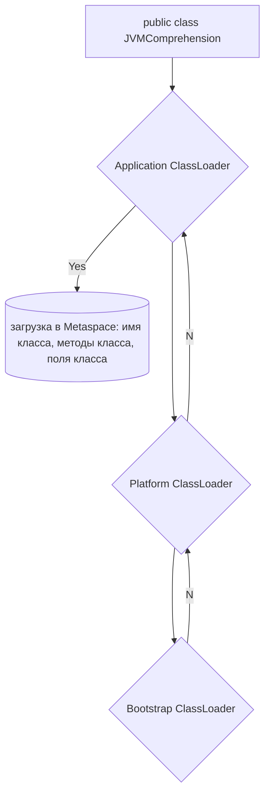
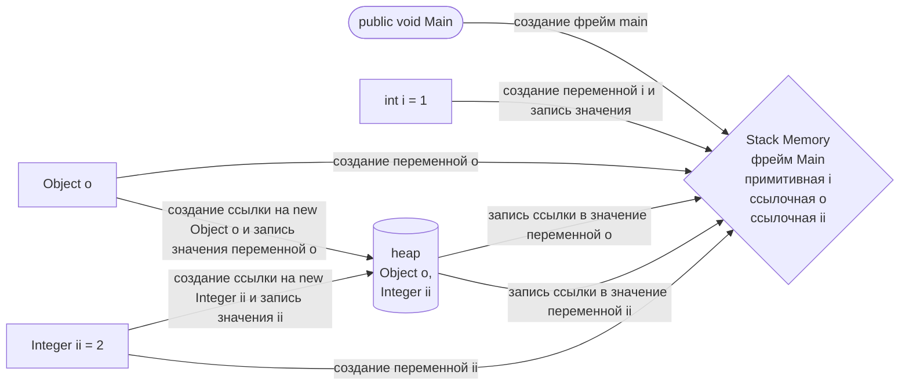
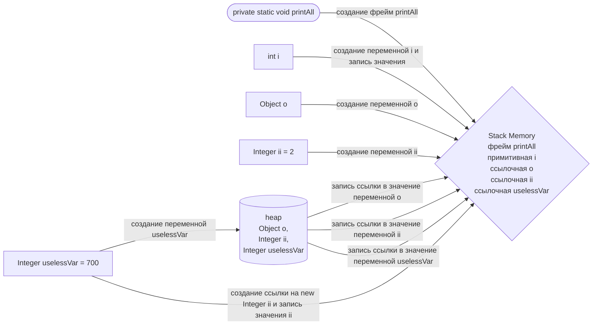
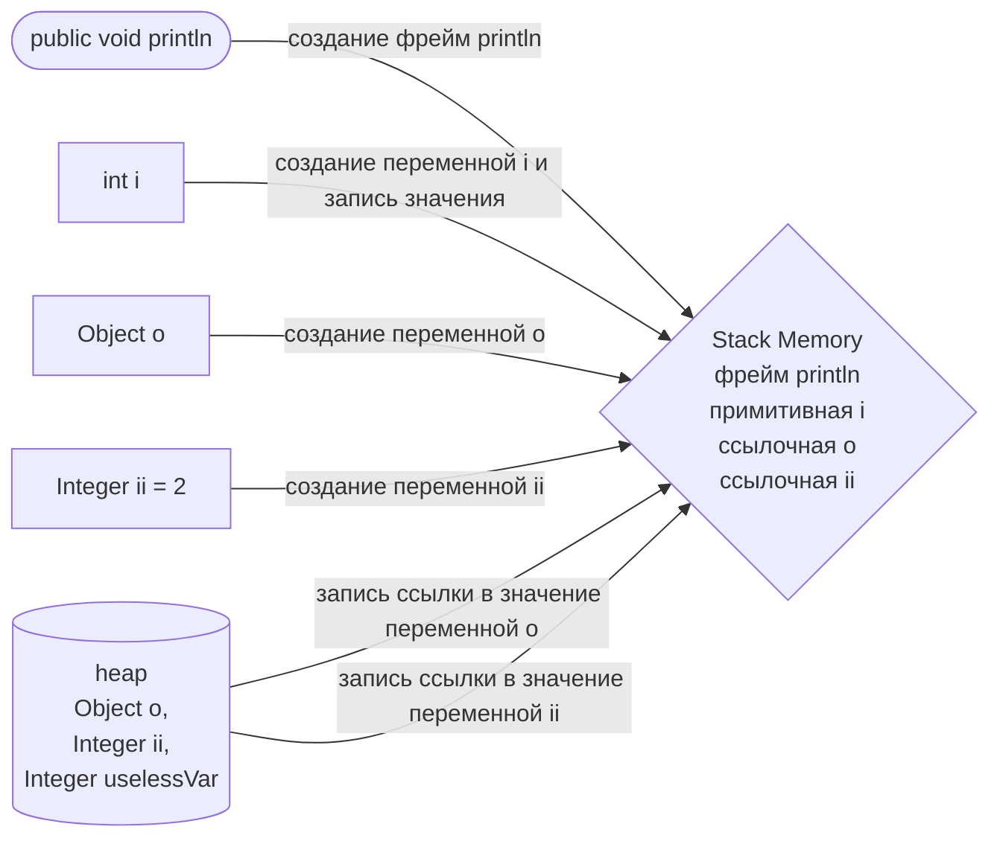
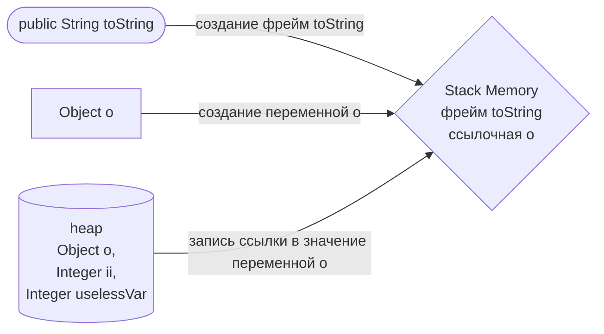
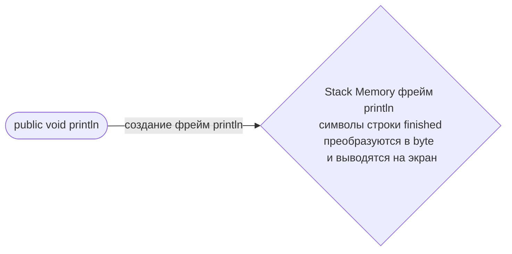

# "Понимание JVM"
## код для исследования:
```java

public class JvmComprehension {

    public static void main(String[] args) {
        int i = 1;                      // 1
        Object o = new Object();        // 2
        Integer ii = 2;                 // 3
        printAll(o, i, ii);             // 4
        System.out.println("finished"); // 7
    }

    private static void printAll(Object o, int i, Integer ii) {
        Integer uselessVar = 700;                   // 5
        System.out.println(o.toString() + i + ii);  // 6
    }
}
```
##шаг 1: инициализация класса **JVMComprehension**:

##шаг 2: инициализация метода **main**
создание в *Stack Memory* фрейма для записи метода **main**

##шаг 3: инициализация метода **printAll**
создание в *Stack Memory* фрейма для записи метода **printAll**

##шаг 4: иницализация метода **System.out.println(o.toString() + i + ii)**

##шаг 5: иницализация метода **toString()**

##шаг 6: исполнение метода **toString()**
после исполнения метода фрейм **toString** удаляется из **Stack Memory**
##шаг 7: исполнение метода **System.out.println(o.toString() + i + ii)**
после исполнения метода фрейм **println** удаляется из **Stack Memory**
##шаг 8: исполнение метода **printAll**
после исполнения метода фрейм **printAll** удаляется из **Stack Memory**
##шаг 9: иницализация метода **System.out.println("finished")**

##шаг 10: исполнение метода **System.out.println("finished")**
после исполнения метода фрейм **println** удаляется из **Stack Memory**
##шаг 11: завершение метода **main**
после завершения метода фрейм **main** удаляется из **Stack Memory**
все данные из heap и Metaspace удаляются ОС